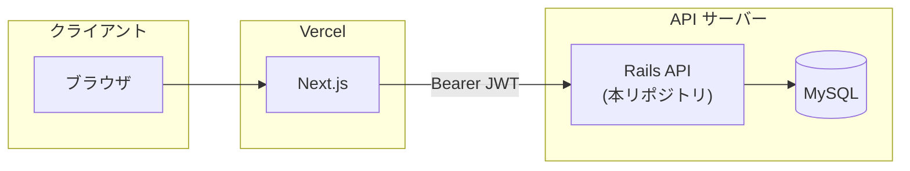
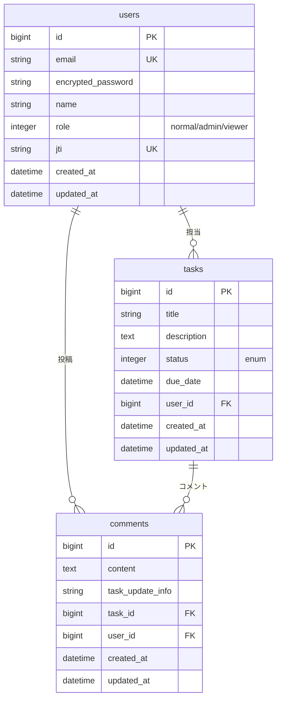

# Portfolio Backend

タスク管理アプリのバックエンド(Rails API)です。
[フロントエンド（Next.js）](https://github.com/init-tshirai/portfolio-frontend) と組み合わせて利用します。

## デモ環境
URL: https://portfolio-frontend-self-psi.vercel.app/
メールアドレス: `normal@example.com`
パスワード: `password`

※上記はフロントエンドのURLになります。
バックエンドのURLは公開していません。（API単体での利用は想定していないため）

---

## 目次

- [使用技術](#使用技術)
- [アーキテクチャ](#アーキテクチャ)
- [ER 図](#er-図)
- [API 設計](#api-設計)
- [技術選定理由](#技術選定理由)
- [ローカル環境でのセットアップ](#ローカル環境でのセットアップ)
- [デプロイ（Railway）](#デプロイrailway)
- [テスト](#テスト)
- [最後に](#最後に)

---

### 使用技術

フロントエンド: Next.js, Tailwind CSS
バックエンド: Ruby on Rails, MySQL
インフラ: Vercel(Next.js), Railway(Ruby on Rails)

---

## アーキテクチャ




### 認証・認可の流れ

1. ユーザーがフロントの `/login` からログインする
2. フロント（Next.js） が `POST /auth/sign_in` を呼び、JWT を **httpOnly Cookie** に保存する
3. 以降は Cookie からトークンを取り出し、`Authorization: Bearer <token>` 付きで API を呼ぶ
4. API 側は **Devise JWT** で認証、**CanCanCan** で認可する

> API 呼び出しは基本的に Next.js サーバー経由のため、ブラウザから Rails への直接リクエストは発生しません。

---

## ER 図




### ロールと権限（CanCanCan）


| role     | 権限            |
| -------- | ------------- |
| `normal` | `Task` の CRUD |
| `admin`  | すべてのリソースを管理   |
| `viewer` | `Task` の閲覧のみ  |


---

## API 設計


### 認証（Devise JWT）


| メソッド     | パス               | 説明                                           |
| -------- | ---------------- | -------------------------------------------- |
| `POST`   | `/auth/sign_in`  | ログイン。レスポンスヘッダー `Authorization: Bearer <JWT>` |
| `DELETE` | `/auth/sign_out` | ログアウト（JWT 失効）                                |


**リクエスト例（sign_in）**

```json
{
  "user": {
    "email": "normal@example.com",
    "password": "password"
  }
}
```

### API v1

いずれも `Authorization: Bearer <JWT>` が必要（profile / tasks / users）。

#### Profile


| メソッド  | パス                | 説明            |
| ----- | ----------------- | ------------- |
| `GET` | `/api/v1/profile` | ログインユーザー情報と権限 |


**レスポンス例**

```json
{
  "id": 1,
  "name": "Normal User",
  "role": "normal",
  "permissions": {
    "tasks": {
      "read": true,
      "create": true,
      "update": true,
      "destroy": true
    }
  }
}
```

#### Tasks


| メソッド     | パス                  | 説明              |
| -------- | ------------------- | --------------- |
| `GET`    | `/api/v1/tasks`     | 一覧（検索・ページネーション） |
| `POST`   | `/api/v1/tasks`     | 作成              |
| `GET`    | `/api/v1/tasks/:id` | 詳細（コメント含む）      |
| `PATCH`  | `/api/v1/tasks/:id` | 更新（コメント付き履歴）    |
| `DELETE` | `/api/v1/tasks/:id` | 削除              |


**一覧クエリパラメータ**


| パラメータ           | 説明                    |
| --------------- | --------------------- |
| `title`         | タイトル部分一致              |
| `status`        | ステータス                 |
| `due_date_from` | 期日 From（ISO 8601 日付）  |
| `due_date_to`   | 期日 To                 |
| `user_id`       | 担当者 ID                |
| `page`          | ページ番号（デフォルト: 1）       |
| `limit`         | 件数（デフォルト: 20、最大: 100） |


**ページネーション（レスポンスヘッダー）**

本文はタスク配列のみ。メタ情報はヘッダーで返します。


| ヘッダー             | 説明         |
| ---------------- | ---------- |
| `X-Total-Count`  | 総件数        |
| `X-Current-Page` | 現在ページ      |
| `X-Per-Page`     | 1 ページあたり件数 |
| `X-Total-Pages`  | 総ページ数      |


**タスク status の値**

`not_started` / `in_progress` / `resolved` / `completed` / `feedback` / `rejected`

**更新（PATCH）リクエスト例**

```json
{
  "task": {
    "status": "in_progress",
    "due_date": "2026-06-01",
    "user_id": 1
  },
  "comment": {
    "content": "着手しました"
  }
}
```

#### Users


| メソッド  | パス                      | 説明                 |
| ----- | ----------------------- | ------------------ |
| `GET` | `/api/v1/users/options` | 担当者セレクト用（id, name） |


### エラーレスポンス


| HTTP  | 内容                                  |
| ----- | ----------------------------------- |
| `401` | 未認証                                 |
| `403` | 権限不足 `{ "error": "アクセス権限がありません。" }` |
| `422` | バリデーションエラー `{ "errors": ["..."] }`  |


### ヘルスチェック


| メソッド  | パス    | 説明           |
| ----- | ----- | ------------ |
| `GET` | `/up` | アプリケーション死活監視 |


---

## 技術選定理由


| 技術 | 選定理由 |
| ----------------------- | ---------------------------------------------------------------------- |
| **Rails 8（API モード）** | REST API を素早く構築できる。優秀なORマッパーであるActive Recordが利用でき、バリデーション・トランザクション等を容易に実装できる。ドキュメントも豊富。 |
| **MySQL**                 | 実務でも多く利用される定番のRDB。 |
| **Devise + devise-jwt**   | APIとして利用するため、将来的にスケールできるようJWTを選択。（認証の失効はjtiで実現。） |
| **CanCanCan**             | ロールごとの認可をシンプルに記述可能 |


---

## ローカル環境でのセットアップ

### 前提

- Ruby 3.4.9
- MySQL
- Bundler
- [portfolio-frontend](https://github.com/init-tshirai/portfolio-frontend) のセットアップおよび起動（`http://localhost:3000`）

### 手順

※先頭の$マークは一般ユーザーで操作することを意味します。コマンドには含めないでください。

bundle install
```bash
$ cd (portfolio-backend のディレクトリ)
$ bundle install
```

DBセットアップ
```bash
$ cp config/database.yml.sample config/database.yml # 内容はご自身の環境に合わせて適宜修正ください。
$ bin/rails db:create
$ bin/rails db:migrate
$ bin/rails db:seed
```

credentials に jwtの秘密鍵追加
```bash
$ bin/rails secret # 出力された文字列をコピーします。
$ bin/rails credentials:edit # 「devise_jwt_secret_key: (コピーした文字列)」の行を追加し、エディタを閉じます。
```

サーバー起動
```bash
$ bin/rails server -p 3001
```

ブラウザで `http://localhost:3000` を開きます。

以下でログインに成功したら成功です。
メールアドレス: normal@example.com
パスワード: password


---

## デプロイ（Railway）

（デプロイ方法調査中）

---

## テスト

※先頭の$マークは一般ユーザーで操作することを意味します。コマンドには含めないでください。

```bash
$ bundle exec rspec
```

---

## 最後に

本アプリケーションは、機能規模だけで言えばRails単体で十分実現可能ですが、
実務で多い「Rails API + フロントエンド」の構成を一通り設計・実装することを目的として作成しました。

認証、認可の実装方法や、フロントとバックエンドの責務の組み立てに苦労しました。
将来的に別のクライアント（モバイルアプリなど）が追加された場合も再利用ように、基本的にバックエンドに任せるようにしています。

「Rais API + フロントエンド」の構成はRails単体に比べて環境や言語が分かれるため、デメリットもあると考えます。
・運用負担向上（環境変数の管理、セキュリティ設定の複雑化）
・可用性低下の危険
・開発要員確保の難易度増（組織による）
アプリケーションの目的・性質によってはRails単体での開発が最適となる可能性もあるため、実務においては柔軟に判断したいと考えます。
