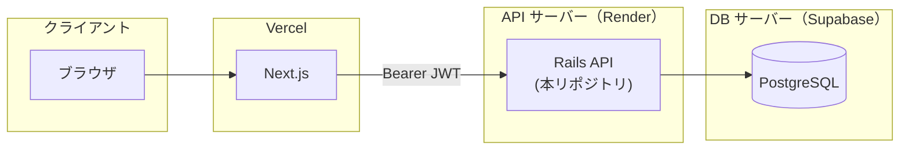
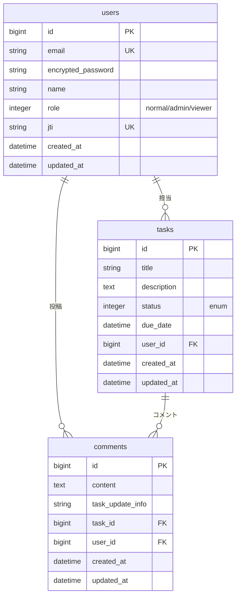

# タスク管理アプリ（バックエンド）

## 概要

タスク管理アプリのバックエンド(Rails API)です。<br>
[フロントエンド（Next.js）](https://github.com/init-tshirai/portfolio-frontend) と組み合わせて利用します。

URL: https://portfolio-frontend-self-psi.vercel.app/ <br>
メールアドレス: `normal@example.com` <br>
パスワード: `faipheiz4ieY`

---

## 目次

- [タスク管理アプリ（バックエンド）](#タスク管理アプリバックエンド)
  - [概要](#概要)
  - [目次](#目次)
    - [使用技術](#使用技術)
  - [アーキテクチャ](#アーキテクチャ)
    - [認証・認可の流れ](#認証認可の流れ)
  - [ER 図](#er-図)
    - [ロールと権限（CanCanCan）](#ロールと権限cancancan)
  - [API 設計](#api-設計)
    - [認証（Devise JWT）](#認証devise-jwt)
    - [API v1](#api-v1)
      - [Profile](#profile)
      - [Tasks](#tasks)
      - [Users](#users)
    - [エラーレスポンス](#エラーレスポンス)
    - [ヘルスチェック](#ヘルスチェック)
  - [技術選定理由](#技術選定理由)
  - [ローカル環境でのセットアップ](#ローカル環境でのセットアップ)
    - [前提](#前提)
    - [手順](#手順)
  - [テスト](#テスト)
  - [最後に](#最後に)

---

### 使用技術

フロントエンドの [使用技術](https://github.com/init-tshirai/portfolio-frontend/#%E4%BD%BF%E7%94%A8%E6%8A%80%E8%A1%93) をご参照ください。

---

## アーキテクチャ

本番環境ではAPIサーバーとDBサーバーを分離して運用しています。



### 認証・認可の流れ

1. ユーザーがフロントの `/login` からログインする
2. フロント（Next.js） が `POST /auth/sign_in` を呼び、JWT を **httpOnly Cookie** に保存する
3. 以降は Cookie からトークンを取り出し、`Authorization: Bearer <token>` 付きで API を呼ぶ
4. API 側は **Devise JWT** で認証、**CanCanCan** で認可する

---

## ER 図



### ロールと権限（CanCanCan）

| role     | 権限            |
| -------- | ------------- |
| `normal` | `Task` の CRUD |
| `admin`  | すべてのリソースを管理   |
| `viewer` | `Task` の閲覧のみ  |

---

## API 設計


### 認証（Devise JWT）

| メソッド     | パス               | 説明                                           |
| -------- | ---------------- | -------------------------------------------- |
| `POST`   | `/auth/sign_in`  | ログイン。レスポンスヘッダー `Authorization: Bearer <JWT>` |
| `DELETE` | `/auth/sign_out` | ログアウト（JWT 失効）                                |


**リクエスト例（sign_in）**

```json
{
  "user": {
    "email": "normal@example.com",
    "password": "password"
  }
}
```

### API v1

#### Profile

| メソッド  | パス                | 説明            |
| ----- | ----------------- | ------------- |
| `GET` | `/api/v1/profile` | ログインユーザー情報と権限 |


**レスポンス例**

```json
{
  "id": 1,
  "name": "Normal User",
  "role": "normal",
  "permissions": {
    "tasks": {
      "read": true,
      "create": true,
      "update": true,
      "destroy": true
    }
  }
}
```

#### Tasks

| メソッド     | パス                  | 説明              |
| -------- | ------------------- | --------------- |
| `GET`    | `/api/v1/tasks`     | 一覧（検索・ページネーション） |
| `POST`   | `/api/v1/tasks`     | 作成              |
| `GET`    | `/api/v1/tasks/:id` | 詳細（コメント含む）      |
| `PATCH`  | `/api/v1/tasks/:id` | 更新（コメント付き履歴）    |
| `DELETE` | `/api/v1/tasks/:id` | 削除              |

**一覧クエリパラメータ**

| パラメータ           | 説明                    |
| --------------- | --------------------- |
| `title`         | タイトル部分一致              |
| `status`        | ステータス                 |
| `due_date_from` | 期日 From  |
| `due_date_to`   | 期日 To                 |
| `user_id`       | 担当者 ID                |
| `page`          | ページ番号（デフォルト: 1）       |
| `limit`         | 件数（デフォルト: 20、最大: 100） |


**ページネーション（レスポンスヘッダー）**

bodyはタスク配列のみ。メタ情報はheaderで返します。


| ヘッダー             | 説明         |
| ---------------- | ---------- |
| `X-Total-Count`  | 総件数        |
| `X-Current-Page` | 現在ページ      |
| `X-Per-Page`     | 1 ページあたり件数 |
| `X-Total-Pages`  | 総ページ数      |


#### Users


| メソッド  | パス                      | 説明                 |
| ----- | ----------------------- | ------------------ |
| `GET` | `/api/v1/users/options` | 担当者セレクト用（id, name） |


### エラーレスポンス


| HTTP  | 内容                                  |
| ----- | ----------------------------------- |
| `401` | 未認証                                 |
| `403` | 権限不足 `{ "error": "アクセス権限がありません。" }` |
| `422` | バリデーションエラー `{ "errors": ["..."] }`  |


### ヘルスチェック


| メソッド  | パス    | 説明           |
| ----- | ----- | ------------ |
| `GET` | `/up` | アプリケーション死活監視 |


---

## 技術選定理由


| 技術 | 選定理由 |
| ----------------------- | ---------------------------------------------------------------------- |
| **Rails 8（API モード）** | REST API を素早く構築できる。優秀なORマッパーであるActive Recordが利用でき、バリデーション・トランザクション等を容易に実装できる。ドキュメントも豊富。 |
| **PostgreSQL**            | 実務でも多く利用される定番のRDB。RenderやSupabaseといったDBのホスティングサービスと相性が良く、サイトの外部公開が容易。 |
| **Devise + devise-jwt**   | APIとして利用するため、将来的にスケールできるようJWTを選択。（認証の失効はjtiで実現。） |
| **CanCanCan**             | ロールごとの認可をシンプルに記述可能 |


---

## ローカル環境でのセットアップ

### 前提

- Ruby3.4.9のインストール
- PostgreSQLのインストール
- [portfolio-frontend](https://github.com/init-tshirai/portfolio-frontend) のセットアップおよび起動（`http://localhost:3000`）

### 手順

※先頭の$マークは一般ユーザーで操作することを意味します。コマンドには含めないでください。

bundle install
```bash
$ cd (portfolio-backend のディレクトリ)
$ bundle install
```

DBセットアップ
```bash
$ cp config/database.yml.sample config/database.yml # 内容はご自身の環境に合わせて適宜修正ください。
$ bin/rails db:create
$ bin/rails db:migrate
$ bin/rails db:seed
```

credentials に jwtの秘密鍵追加
```bash
$ bin/rails secret # 出力された文字列をコピーします。
$ bin/rails credentials:edit # 「devise_jwt_secret_key: (コピーした文字列)」の行を追加し、エディタを閉じます。
```

サーバー起動
```bash
$ bin/rails server -p 3001
```

ブラウザで `http://localhost:3000` を開きます。

以下でログインに成功したら成功です。
メールアドレス: normal@example.com
パスワード: password

---

## テスト

※先頭の$マークは一般ユーザーで操作することを意味します。コマンドには含めないでください。

```bash
$ bundle exec rspec
```

---

## 最後に

フロントエンドの [「最後に」](https://github.com/init-tshirai/portfolio-frontend/#%E6%9C%80%E5%BE%8C%E3%81%AB)
 を参照してください。
