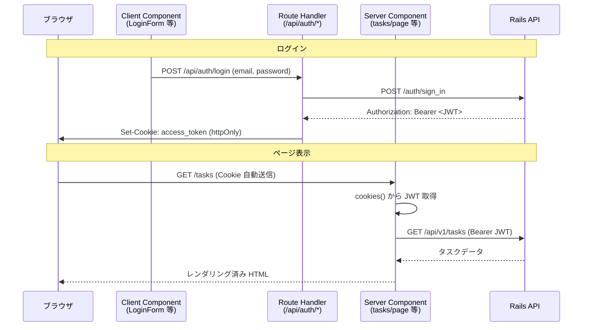

## 認証・認可について

### 流れ

1. ユーザーがフロントの `/login` からログインする
2. Next.js の Route Handler（`POST /api/auth/login`）が `POST /auth/sign_in` を呼び、返却された JWT を httpOnly Cookie（`access_token`）に保存する
3. 以降、Server Component が Cookie からトークンを取り出し、`Authorization: Bearer <token>` 付きで API をサーバー側から呼ぶ
4. API 側は Devise JWT で認証、CanCanCan で認可する
5. ログアウト時は `DELETE /api/auth/logout` 経由で `DELETE /auth/sign_out` を呼び、Cookie を削除する

#### 全体の流れ（シーケンス図）

### ロールと権限（CanCanCan）

| role     | 権限            |
| -------- | ------------- |
| `normal` | `Task` の CRUD |
| `admin`  | すべてのリソースを管理   |
| `viewer` | `Task` の閲覧のみ  |
